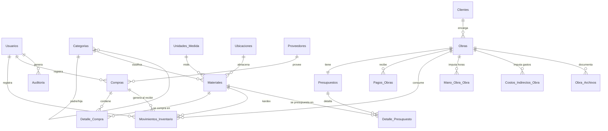
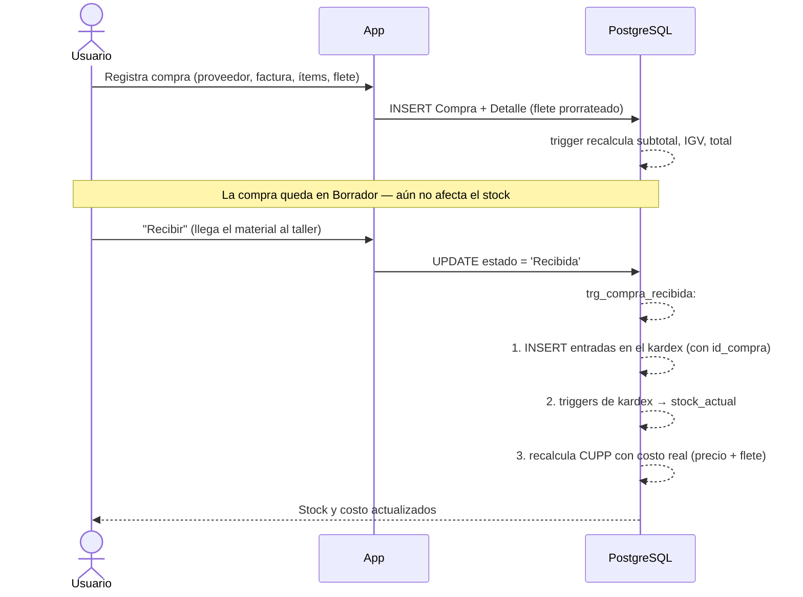
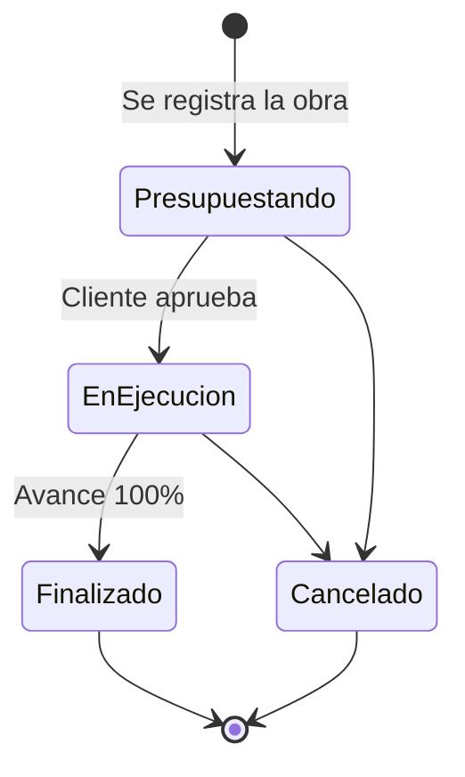

# Sistema de Gestión para Taller de Metalmecánica
## Documentación técnica — Taller Villanueva v2.0

> Documento de sustentación. Describe el dominio del negocio, el modelo de datos, las
> reglas de integridad, los flujos operativos y las decisiones de arquitectura del
> sistema, con su justificación.

---

## Índice

1. [Dominio del negocio y alcance](#1-dominio-del-negocio-y-alcance)
2. [Modelo de datos](#2-modelo-de-datos)
3. [Diccionario de datos](#3-diccionario-de-datos)
4. [Reglas de negocio e integridad](#4-reglas-de-negocio-e-integridad)
5. [Flujos operativos](#5-flujos-operativos)
6. [Arquitectura del software](#6-arquitectura-del-software)
7. [Seguridad y auditoría](#7-seguridad-y-auditoría)
8. [Verificación y calidad](#8-verificación-y-calidad)
9. [Limitaciones y trabajo futuro](#9-limitaciones-y-trabajo-futuro)

---

## 1. Dominio del negocio y alcance

### 1.1 El negocio

Un **taller de metalmecánica** transforma materia prima de acero (perfiles, planchas,
tubos) en estructuras y piezas fabricadas a medida (naves industriales, techos, escaleras,
portones). Su operación se articula sobre cuatro ejes que el sistema debe cubrir de forma
integrada:

| Eje | Problema real que resuelve |
| --- | --- |
| **Comercial** | ¿Quién es el cliente, qué obra encargó, cuánto se le presupuestó y cuánto ha pagado? |
| **Inventario** | ¿Qué material hay, dónde está físicamente guardado, cuánto queda y cuándo reponer? |
| **Compras** | ¿A qué proveedor se compró, a qué precio real (con IGV y flete) y cómo impacta el costo? |
| **Producción y costeo** | ¿Cuánto costó *realmente* fabricar una obra vs. lo que se presupuestó? |

### 1.2 El problema central: el costo real

La pregunta que da sentido al sistema es **"¿esta obra fue rentable?"**. Responderla exige
encadenar información que en la mayoría de talleres vive dispersa en cuadernos y hojas
sueltas:

```
Compra al proveedor → costo real del material (precio + IGV + flete)
        ↓
   CUPP del material (promedio ponderado)
        ↓
Salida de material a la obra → costo de materiales consumidos
        +  horas-hombre × tarifa      → costo de mano de obra
        +  energía, transporte, equipos → costos indirectos
        ↓
   COSTO REAL DE LA OBRA  ←→  comparado con  →  PRESUPUESTO
        ↓
                    MARGEN REAL
```

El sistema modela **esta cadena completa**, y esa es su diferencia frente a un CRUD de
inventario.

### 1.3 Particularidades del rubro modeladas

- **La merma no es uniforme.** Cortar una plancha genera retazos inservibles (~12%);
  cortar un perfil lineal desperdicia mucho menos (~6%); un electrodo casi no merma (~3%).
  Un porcentaje global sería una simplificación que falsea el presupuesto → el sistema
  maneja **merma por material, con herencia desde su categoría**.
- **El material se identifica por especificación técnica, no solo por nombre.** Dos
  planchas del mismo tamaño pero de norma ASTM A36 vs. AISI 304 (inoxidable) son materiales
  distintos, con precios muy diferentes → se modelan `norma`, `espesorMm`, `medidas`,
  `acabado` y `pesoUnitario`.
- **El acero es voluminoso y pesado: su ubicación física importa.** Los perfiles van en
  racks con puente grúa, las planchas en caballetes horizontales, los consumibles en
  ambiente seco → se modela **Zona → Estante → Nivel**.
- **El flete es parte del costo.** Traer una tonelada de acero cuesta dinero y ese costo
  debe repartirse entre los ítems comprados → el sistema **prorratea el flete** al costo
  unitario real.
- **Régimen tributario peruano.** Los montos se manejan en **PEN** con **IGV del 18%**
  separado del subtotal.

### 1.4 Alcance

**Incluido:** gestión de usuarios y roles; clientes; catálogos de clasificación
(categorías jerárquicas, unidades de medida) y de ubicaciones físicas; materiales con
especificación técnica; kardex de inventario (entradas/salidas/ajustes); proveedores y
órdenes de compra con IGV y flete; obras con avance; presupuestos con merma ponderada e
IGV; pagos y saldos; costeo real (materiales + mano de obra + indirectos); rentabilidad;
bocetos/planos adjuntos; 7 reportes con filtros; auditoría integral.

**Excluido (justificado):** facturación electrónica con SUNAT (requiere certificado
digital y homologación, fuera del alcance); planilla y régimen laboral (el sistema imputa
horas a costo, no gestiona nómina); múltiples almacenes físicos separados (el modelo de
ubicaciones cubre un local); stock por ubicación con traslados internos (se registra la
ubicación principal del material).

---

## 2. Modelo de datos

### 2.1 Cifras del esquema implementado

Verificadas sobre la base de datos en producción (PostgreSQL / Supabase):

| Elemento | Cantidad |
| --- | --- |
| Tablas | **18** |
| Vistas | **4** |
| Claves foráneas | **31** |
| Restricciones CHECK | **170** |
| Triggers | **7** |
| Funciones PL/pgSQL | **9** |
| Tipos ENUM | **11** |

### 2.2 Diagrama entidad-relación



### 2.3 Organización por subsistemas

**A. Catálogos** (`Categorias`, `Unidades_Medida`, `Ubicaciones`, `Proveedores`)
Normalizan la información maestra. Antes eran texto libre; formalizarlos elimina
inconsistencias ("Perfiles" / "perfiles" / "PERFILES" como tres categorías distintas) y
permite asociar reglas de negocio a la clasificación (la merma por categoría).

**B. Inventario** (`Materiales`, `Movimientos_Inventario`)
`Materiales` es el maestro con especificación técnica. `Movimientos_Inventario` es el
**kardex**: el libro inmutable de todo lo que entra y sale. El stock **no se edita**: es
el resultado de los movimientos.

**C. Compras** (`Compras`, `Detalle_Compra`)
Documenta la adquisición real. Al recibirse, alimenta el kardex y recalcula el CUPP.

**D. Comercial y producción** (`Clientes`, `Obras`, `Presupuestos`,
`Detalle_Presupuesto`, `Pagos_Obras`, `Obra_Archivos`)

**E. Costeo** (`Mano_Obra_Obra`, `Costos_Indirectos_Obra`)

**F. Control** (`Usuarios`, `Auditoria`)

### 2.4 Vistas

| Vista | Propósito |
| --- | --- |
| `v_rentabilidad_obras` | Presupuestado vs. costo real (materiales + mano de obra + indirectos) y margen, por obra. |
| `v_inventario_ubicado` | Inventario con categoría, categoría padre, unidad y ubicación resueltas, valorización y bandera de bajo stock. |
| `v_saldo_obras` | Monto presupuestado, total abonado y saldo pendiente por obra. |
| `v_materiales_bajo_stock` | Materiales activos en o por debajo del mínimo. |

### 2.5 Decisiones de modelado y su justificación

| Decisión | Justificación |
| --- | --- |
| **Categorías jerárquicas** (auto-referencia `id_categoria_padre`) | El rubro es naturalmente jerárquico: *Acero estructural → Perfiles → Perfil C*. Una tabla plana obligaría a duplicar o a inventar prefijos. La auto-referencia permite profundidad arbitraria con una sola tabla. |
| **Merma en dos niveles** (material → categoría) | Da precisión sin obligar a configurar cada material: si el material no define merma, hereda la de su categoría. Regla implementada en `fn_merma_efectiva()`. |
| **Unidades con `tipo` y `factor_base`** | Impide operaciones sin sentido (sumar Kg con Metros) y habilita conversiones dentro de una misma magnitud. |
| **Ubicación como tabla, no como texto** | Permite listar qué hay en cada zona, detectar materiales sin ubicar y validar unicidad de Zona/Estante/Nivel. Con texto libre eso es imposible. |
| **`saldo_resultante` en cada movimiento** | Es *denormalización deliberada*: guarda el saldo histórico tras cada movimiento. Permite auditar el stock en cualquier fecha pasada sin recalcular toda la cadena. |
| **Compra con estados** (Borrador→Confirmada→Recibida) | Separa el *acuerdo* comercial del *hecho físico*. El stock solo se mueve al recibir, que es cuando el material realmente entra al taller. |
| **Flete prorrateado en el detalle** | El costo real de un material incluye traerlo. Guardarlo por línea permite auditar el cálculo del CUPP. |
| **`precio_unitario_momento` en el presupuesto** | Congela el precio al presupuestar. Si el CUPP cambia después, el presupuesto histórico no se altera (integridad temporal). |
| **Presupuesto 1:1 con obra** | Regla del negocio: una obra se cotiza una vez; re-presupuestar reemplaza el detalle. Se aplica con un UNIQUE en `id_obra`. |

---

## 3. Diccionario de datos

Se detallan las tablas con reglas no evidentes. Todas incluyen trazabilidad
(`creado_en`, y donde aplica `creado_por`/`actualizado_por`).

### 3.1 `Categorias` — clasificación jerárquica

| Columna | Tipo | Reglas |
| --- | --- | --- |
| `id_categoria` | SERIAL PK | |
| `nombre` | VARCHAR(80) NOT NULL | UNIQUE junto con `id_categoria_padre` |
| `id_categoria_padre` | INTEGER FK → Categorias | NULL = categoría raíz. ON DELETE SET NULL |
| `porcentaje_merma` | DECIMAL(5,2) DEFAULT 6.00 | CHECK 0–100. Merma heredable |
| `estado` | ENUM | Activo / Inactivo |

> CHECK `id_categoria_padre <> id_categoria`: impide que una categoría sea su propio padre.

### 3.2 `Unidades_Medida`

| Columna | Tipo | Reglas |
| --- | --- | --- |
| `simbolo` | VARCHAR(10) | UNIQUE. Ej.: `m`, `kg`, `pln` |
| `tipo` | ENUM | Longitud, Masa, Area, Volumen, Unidad |
| `factor_base` | DECIMAL(12,6) DEFAULT 1 | CHECK > 0. Equivalencia con la unidad base de su tipo |

### 3.3 `Ubicaciones` — el almacén físico

| Columna | Tipo | Reglas |
| --- | --- | --- |
| `zona` | VARCHAR(50) NOT NULL | Ej.: "Zona A", "Patio" |
| `estante` | VARCHAR(50) | Ej.: "Rack 1", "Caballete 2" |
| `nivel` | VARCHAR(50) | Ej.: "Nivel 1" |
| `capacidad_max` | DECIMAL(10,2) | CHECK > 0 |

> UNIQUE `(zona, estante, nivel) NULLS NOT DISTINCT`: sin esa cláusula, PostgreSQL trata
> cada NULL como distinto y permitiría duplicar ("Zona E", NULL, NULL) infinitas veces.

### 3.4 `Materiales` — maestro con especificación técnica

| Columna | Tipo | Reglas |
| --- | --- | --- |
| `codigo_material` | VARCHAR(50) | UNIQUE |
| `id_categoria` | FK NOT NULL | ON DELETE RESTRICT |
| `id_unidad` | FK NOT NULL | ON DELETE RESTRICT |
| `id_ubicacion` | FK NULL | ON DELETE SET NULL (permite "sin ubicar") |
| `norma` | VARCHAR(50) | ASTM A36, ASTM A500, AISI 304… |
| `espesor_mm` | DECIMAL(8,2) | CHECK > 0 |
| `medidas` | VARCHAR(80) | 4'x8', 6"x2", Ø 2" |
| `acabado` | VARCHAR(50) | Negro, Galvanizado, Inoxidable |
| `peso_unitario` | DECIMAL(10,3) | CHECK > 0. kg por unidad de medida |
| `stock_actual` | DECIMAL(10,2) | **CHECK ≥ 0.** Solo lo modifican los triggers del kardex |
| `stock_minimo` / `stock_maximo` | DECIMAL(10,2) | CHECK máx ≥ mín |
| `cupp` | DECIMAL(10,2) | CHECK ≥ 0. Lo recalcula la recepción de compras |
| `porcentaje_merma` | DECIMAL(5,2) NULL | NULL ⇒ hereda de la categoría |

### 3.5 `Movimientos_Inventario` — el kardex

| Columna | Tipo | Reglas |
| --- | --- | --- |
| `tipo_movimiento` | ENUM | Entrada / Salida / Ajuste |
| `cantidad` | DECIMAL(10,2) | **CHECK > 0** |
| `saldo_resultante` | DECIMAL(10,2) | Lo calcula el trigger, no la aplicación |
| `costo_unitario` | DECIMAL(10,2) | Costo real del movimiento |
| `id_obra` | FK NULL | Si hay obra, es consumo imputable a su costo |
| `id_compra` | FK NULL | Trazabilidad: movimiento → factura → proveedor |
| `id_usuario` | FK **NOT NULL** | ON DELETE RESTRICT — todo movimiento tiene responsable |

> `id_usuario` es **RESTRICT y NOT NULL** a propósito: un movimiento de inventario sin
> responsable es inauditable. Por eso un usuario con movimientos no puede borrarse, solo
> desactivarse.

### 3.6 `Compras` / `Detalle_Compra`

| Columna | Tipo | Reglas |
| --- | --- | --- |
| `numero_documento` | VARCHAR(50) | UNIQUE junto con `id_proveedor` |
| `estado` | ENUM | Borrador / Confirmada / Recibida / Anulada |
| `subtotal`, `igv_monto`, `total` | DECIMAL(12,2) | Los calcula un trigger |
| `flete` | DECIMAL(12,2) | Se prorratea al detalle |
| `fecha_recepcion` | DATE | CHECK ≥ `fecha_emision` |
| `Detalle_Compra.flete_prorrateado` | DECIMAL(10,2) | Parte del flete imputada a la línea |

### 3.7 `Presupuestos`

| Columna | Reglas |
| --- | --- |
| `id_obra` | **UNIQUE** — un presupuesto por obra |
| `costo_materiales_base`, `costo_mermas`, `subtotal`, `igv_monto`, `monto_total` | Calculados por trigger |
| `igv_porcentaje` | DEFAULT 18.00, CHECK 0–100 |
| `moneda` | DEFAULT 'PEN' |

### 3.8 `Mano_Obra_Obra` / `Costos_Indirectos_Obra`

| Columna | Reglas |
| --- | --- |
| `horas` | CHECK > 0 **y ≤ 24** (no se pueden imputar 30 h en un día) |
| `tarifa_hora` | CHECK ≥ 0 |
| `monto` (indirectos) | CHECK > 0 |
| `tipo` (indirectos) | ENUM: Energia, Transporte, Equipos, Consumibles, Subcontrato, Otro |

---

## 4. Reglas de negocio e integridad

**Principio rector: la base de datos es la última línea de defensa.** Las reglas críticas
se implementan en PostgreSQL (constraints + triggers), no solo en la aplicación. Si mañana
alguien accede por `psql` o por otro cliente, las reglas se siguen cumpliendo.

### 4.1 RN-01 — El stock nunca se edita a mano

**Regla:** `Materiales.stock_actual` solo cambia como consecuencia de un movimiento de
inventario.

**Implementación:** `trg_movimientos_before_insert` calcula el saldo y
`trg_movimientos_after_insert` lo aplica al material. La capa de aplicación **no** incluye
`stockActual` en sus operaciones de actualización.

**Por qué:** si el stock fuera editable, el kardex y la existencia real divergirían y el
inventario dejaría de ser auditable.

### 4.2 RN-02 — No se puede sacar material que no existe

```sql
IF NEW.tipo_movimiento = 'Salida' AND stock_disponible < NEW.cantidad THEN
    RAISE EXCEPTION 'Stock insuficiente para realizar la salida de material.';
END IF;
```

El `SELECT ... FOR UPDATE` previo bloquea la fila del material, evitando condiciones de
carrera si dos usuarios registran salidas simultáneas.
**Verificado:** el test intenta una salida mayor al stock y la BD la rechaza.

### 4.3 RN-03 — Merma ponderada por material

**Regla:** la merma de un presupuesto es la suma de la merma real de cada material, no un
porcentaje plano.

```
merma_efectiva(material) = material.porcentaje_merma
                        ?? categoria.porcentaje_merma
                        ?? 6%
```

**Ejemplo verificado:** S/1000 de plancha (12%) + S/1000 de perfil (6%) = **S/180** de
merma. Un 6% plano habría dado S/120 — un error de S/60 (33% de subestimación) que se
traslada íntegro al precio ofertado al cliente.

### 4.4 RN-04 — Los importes los calcula la base de datos

**Regla:** al modificar el detalle de un presupuesto o de una compra, los totales se
recalculan solos.

| Documento | Fórmula |
| --- | --- |
| Presupuesto | `base = Σ(cant × precio)`<br>`mermas = Σ(cant × precio × merma_efectiva%)`<br>`subtotal = (base + mermas + mano_obra) × (1 + margen%)`<br>`igv = subtotal × 18%`<br>`total = subtotal + igv` |
| Compra | `subtotal = Σ(cant × costo)`<br>`igv = (subtotal + flete) × 18%`<br>`total = (subtotal + flete) × 1.18` |

**Por qué:** evita la duplicación de aritmética entre cliente y servidor. La interfaz
muestra una *vista previa* con la misma fórmula, pero el valor persistido siempre lo
determina la BD. Es imposible que queden descuadrados.

### 4.5 RN-05 — El CUPP refleja el costo real de adquisición

Al pasar una compra a **Recibida**, por cada ítem:

```
costo_real_unitario = costo_unitario + (flete_prorrateado / cantidad)

CUPP_nuevo = (stock_previo × CUPP_previo + cantidad × costo_real_unitario)
             ─────────────────────────────────────────────────────────────
                              stock_previo + cantidad
```

**Ejemplo verificado:** 100 m de perfil a S/40 + S/100 de flete, con stock previo de 125 m
a CUPP S/28.50 → costo real S/41/m → **CUPP S/34.06**.

**Por qué promedio ponderado y no FIFO:** el acero es un commodity fungible — los metros de
perfil comprados en dos lotes son indistinguibles en el rack. El PP refleja el costo
económico real de reposición y es el método que la práctica contable del rubro usa.

### 4.6 RN-06 — Una compra recibida es inmutable

Una vez recibida, la compra **no puede editarse ni eliminarse**: ya movió stock y modificó
el CUPP. La validación está en la capa de aplicación (`guardarCompra` y `eliminarCompra`
rechazan el estado `Recibida`).

### 4.7 RN-07 — Borrado lógico ante dependencias

Ninguna entidad con historial se elimina físicamente. Si tiene dependencias, se
**desactiva**:

| Entidad | Condición | Acción |
| --- | --- | --- |
| Cliente | tiene obras | → Inactivo |
| Material | tiene movimientos o está presupuestado | → Descontinuado |
| Usuario | tiene movimientos de inventario | → Inactivo |
| Proveedor | tiene compras | → Inactivo |
| Categoría | tiene materiales o subcategorías | → Inactivo |
| Ubicación | tiene materiales | **se rechaza** (pide reubicar primero) |
| Obra | tiene pagos | → Cancelada |

**Por qué:** borrar un material con historial rompería el kardex y los presupuestos
pasados. La trazabilidad pesa más que la limpieza de la tabla.

### 4.8 Catálogo de restricciones CHECK

170 CHECK activas. Las representativas:

| Restricción | Regla |
| --- | --- |
| `chk_materiales_stock_actual` | `stock_actual >= 0` — el stock físico nunca es negativo |
| `chk_materiales_stock_maximo` | `stock_maximo >= stock_minimo` |
| `chk_movimientos_cantidad` | `cantidad > 0` — el tipo define el signo, no la cantidad |
| `chk_obras_avance` | `porcentaje_avance BETWEEN 0 AND 100` |
| `chk_obras_fechas` | `fecha_entrega_estimada >= fecha_inicio` |
| `chk_compras_fechas` | `fecha_recepcion >= fecha_emision` — no se recibe antes de emitir |
| `chk_mano_obra_horas` | `horas > 0 AND horas <= 24` |
| `chk_categorias_no_autopadre` | una categoría no puede ser su propio padre |
| `chk_detalle_cantidad` | `cantidad_requerida > 0` |

### 4.9 Triggers implementados

| Trigger | Tabla | Momento | Función |
| --- | --- | --- | --- |
| `trg_movimientos_before_insert` | Movimientos_Inventario | BEFORE INSERT | Valida stock, calcula `saldo_resultante` |
| `trg_movimientos_after_insert` | Movimientos_Inventario | AFTER INSERT | Actualiza `stock_actual` |
| `trg_detalle_presupuesto_recalc` | Detalle_Presupuesto | AFTER I/U/D | Recalcula el presupuesto (merma ponderada + IGV) |
| `trg_detalle_compra_recalc` | Detalle_Compra | AFTER I/U/D | Recalcula totales de la compra |
| `trg_compra_recibida` | Compras | AFTER UPDATE OF estado | Genera entradas del kardex y recalcula el CUPP |
| `trg_obras_audit` | Obras | AFTER I/U | Registra en auditoría |
| `trg_materiales_audit` | Materiales | AFTER UPDATE | Audita cambios de stock |

---

## 5. Flujos operativos

### 5.1 Compra de material (del proveedor al almacén)



**Punto clave:** el estado *Borrador* separa el compromiso comercial del hecho físico. El
stock solo se mueve cuando el material entra realmente.

### 5.2 Ciclo de vida de una obra



Durante **En Ejecución** se acumula el costo real: salidas de material (kardex), horas de
mano de obra y costos indirectos.

### 5.3 Presupuesto → costo real → margen

```
PRESUPUESTO (lo que se ofertó)          COSTO REAL (lo que se gastó)
├── materiales (cant × precio)          ├── salidas de material (kardex × costo)
├── mermas (ponderadas por material)    ├── horas-hombre × tarifa
├── mano de obra estimada               └── costos indirectos
├── margen %
└── + IGV 18%
              ↓                                       ↓
        monto_total          ─────────────►    costo_total_real
                              MARGEN REAL = presupuestado − real
```

Este contraste es el que expone `v_rentabilidad_obras` y el reporte de Rentabilidad.

### 5.4 Reposición de stock

1. `stock_actual <= stock_minimo` → el material se marca **Bajo stock** (dashboard,
   inventario y reporte).
2. Se registra una compra al proveedor.
3. Al recibirla, el stock sube y el CUPP se ajusta al nuevo costo.

---

## 6. Arquitectura del software

### 6.1 Vista general

```
┌──────────────────────────────────────────────┐
│  Escritorio (Electron)   │   Navegador       │
│  ventana sin marco       │   (Vercel)        │
└────────────┬─────────────┴─────────┬─────────┘
             │   servidor Next.js embebido / desplegado
             ▼                       ▼
┌──────────────────────────────────────────────┐
│  Next.js 15 — App Router                     │
│  ├── Middleware: verificación de JWT         │
│  ├── Server Components: consultas (Prisma)   │
│  ├── Server Actions: mutaciones + validación │
│  └── Client Components: interacción          │
└────────────────────┬─────────────────────────┘
                     │  Prisma 7 (driver adapter pg)
                     ▼
┌──────────────────────────────────────────────┐
│  PostgreSQL (Supabase)                       │
│  Tablas · Constraints · Triggers · Vistas    │
│  RLS habilitado                              │
├──────────────────────────────────────────────┤
│  Supabase Storage — bocetos y planos         │
└──────────────────────────────────────────────┘
```

### 6.2 Defensa en profundidad de la validación

La misma regla se verifica en tres capas, cada una con un propósito distinto:

| Capa | Herramienta | Propósito |
| --- | --- | --- |
| **Cliente** | Estado de React, selects, `disabled` | Feedback inmediato; evita errores obvios |
| **Servidor** | Esquemas Zod en Server Actions | Frontera de confianza: nada entra sin validar |
| **Base de datos** | CHECK, FK, UNIQUE, triggers | Garantía final, independiente de la aplicación |

Ejemplo: un material duplicado en un presupuesto se previene deshabilitándolo en el select
(cliente), se rechaza con un `refine` de Zod (servidor) y, en última instancia, lo impide
el UNIQUE `(id_presupuesto, id_material)` (BD).

### 6.3 Decisiones de arquitectura

| Decisión | Alternativa descartada | Justificación |
| --- | --- | --- |
| **Lógica crítica en triggers** | Toda la lógica en la app | La BD es accesible por otros medios (psql, Studio). Las reglas del negocio deben vivir donde no se puedan eludir. |
| **Prisma 7 con driver adapter** | Prisma 6 (motor Rust) | Sin binarios nativos por SO → empaquetar en Electron se vuelve viable. Fue el factor decisivo. |
| **Server Actions** | API REST | Menos código repetido, tipado extremo a extremo, y `DATABASE_URL` jamás llega al cliente. |
| **Auth propia (usuario + bcrypt + JWT)** | Supabase Auth | El taller opera con **nombre de usuario**, no con correo; Supabase Auth es email-first. Forzarlo habría distorsionado el flujo real del negocio. |
| **RLS activo sin políticas** | RLS desactivado | Bloquea la API REST pública de Supabase. La app entra por Prisma con el rol `postgres` (BYPASSRLS). Superficie de ataque mínima. |
| **Storage con service-role en el servidor** | Subida directa del cliente | Al no usar Supabase Auth no hay contexto de usuario para las políticas de Storage; las subidas pasan por el backend y la clave nunca se expone. |
| **Electron con servidor Next embebido** | Ventana apuntando a la web | Funciona como aplicación local real (modelo Discord), sin depender de que la web esté desplegada. |
| **Denormalizar `saldo_resultante`** | Recalcular al vuelo | Permite auditar el stock histórico en O(1) sin recorrer todo el kardex. |

### 6.4 Estructura del código

```
prisma/
  schema.prisma        Modelo de datos
  migrations/          Esquema versionado (4 migraciones)
  seed.ts              Datos base realistas del rubro
scripts/
  smoke-triggers.ts    Verificación de triggers v1
  smoke-v2.ts          Verificación de triggers v2 (merma, CUPP, compras)
  smoke-storage.ts     Verificación del Storage
  seed-demo.ts         Datos financieros de demostración
  gen-icons.mjs        Generación del ícono de la app
src/
  lib/                 prisma, auth, validaciones (Zod), utils, audit, storage
  middleware.ts        Protección de rutas
  components/ui/       Sistema de diseño
  components/layout/   Sidebar, Header, TitleBar, Perfil
  app/(app)/
    dashboard/  usuarios/  clientes/  obras/  inventario/
    almacen/    compras/   precios/   reportes/  mi-perfil/
electron/              Proceso principal, preload, pantalla de carga
```

---

## 7. Seguridad y auditoría

### 7.1 Autenticación

- Contraseñas con **bcrypt** (coste 10). Nunca en texto plano.
- Sesión en **JWT firmado (HS256)** dentro de cookie **httpOnly** — inaccesible a
  JavaScript, lo que mitiga el robo de sesión por XSS.
- **Bloqueo por fuerza bruta:** 5 intentos fallidos → 15 minutos de bloqueo
  (`intentos_fallidos`, `bloqueado_hasta`).
- El middleware valida el JWT en cada petición a rutas protegidas.

### 7.2 Autorización

Dos roles: **Administrador** (acceso total, incluida gestión de usuarios, catálogos y
reportes financieros) y **Trabajador/Empleado** (operación diaria). Los reportes
financieros verifican el rol en el servidor (`redirect`), no solo ocultando el enlace —
ocultar un botón no es control de acceso.

### 7.3 Auditoría

La tabla `Auditoria` registra tabla afectada, id del registro, acción, datos anteriores y
nuevos (**JSONB**), usuario y fecha. Se alimenta por dos vías:

1. **Triggers de BD** (Obras, stock de Materiales) — inevitables.
2. **Helper `registrarAuditoria`** en las Server Actions para el resto de tablas, siempre
   con el usuario de la sesión.

Toda escritura sensible queda asociada a su responsable.

### 7.4 Protección de datos

- `DATABASE_URL` y `SUPABASE_SERVICE_ROLE_KEY` solo existen en el servidor.
- RLS activo en las 18 tablas.
- El `.env` nunca se versiona; en producción las variables viven en el panel del hosting.

---

## 8. Verificación y calidad

### 8.1 Estrategia

Las reglas de negocio críticas se verifican **contra la base de datos real**, no con
simulaciones. Los tests envuelven sus escrituras en transacciones con rollback, por lo que
no dejan datos.

### 8.2 Resultados (12/12)

| Verificación | Resultado |
| --- | --- |
| El kardex bloquea salidas sin stock | ✅ |
| Una entrada actualiza el stock | ✅ 125 → 130 |
| **Merma ponderada por material** | ✅ S/180 (12% + 6%), no S/120 |
| IGV 18% y total del presupuesto | ✅ subtotal 2180 → IGV 392.40 → total 2572.40 |
| Totales de compra (subtotal + flete + IGV) | ✅ 4000 + 100 → 4838 |
| Recepción genera entrada en el kardex | ✅ 125 → 225 |
| Trazabilidad movimiento → compra | ✅ |
| **CUPP con costo real (precio + flete)** | ✅ 28.50 → 34.06 |
| Vistas `v_rentabilidad_obras` / `v_inventario_ubicado` | ✅ |
| Storage: bucket, subida, URL pública, borrado | ✅ |
| Migración v2: backfill sin pérdida de datos | ✅ |
| Compilación (`tsc` + `next build`, 15 rutas) | ✅ |

### 8.3 Migración sin pérdida de datos

La migración v2 convirtió texto libre en catálogos normalizados **preservando la
información existente**: mapeó cada categoría y unidad a su registro de catálogo, creando
las faltantes; asignó ubicación (o "Zona E — Patio" por defecto); recalculó los
presupuestos al modelo con IGV; y solo entonces eliminó las columnas antiguas y aplicó las
FK como NOT NULL. Verificado: los 4 materiales previos quedaron correctamente clasificados
(Perfiles → Acero estructural, Soldadura → Consumibles).

---

## 9. Limitaciones y trabajo futuro

### 9.1 Limitaciones conocidas

| Limitación | Impacto | Motivo |
| --- | --- | --- |
| **Un material = una ubicación** | No se puede repartir un mismo material en dos zonas | Requeriría `Stock_Ubicacion` y traslados internos; el kardex pasaría a ser por ubicación. Innecesario para un local único. |
| **Filtro "bajo stock" resuelto en memoria** | No escalaría con decenas de miles de materiales | Prisma no compara dos columnas en un `where`. Se resolvería con `$queryRaw` o una columna generada. |
| **Sin facturación electrónica (SUNAT)** | El presupuesto no es un comprobante fiscal | Exige certificado digital y homologación. |
| **Sin auto-actualización del escritorio** | Cada versión requiere reinstalar | Requiere `electron-updater` y un canal de distribución. |
| **Merma como % y no por optimización de corte** | No calcula el despiece óptimo | Sería un problema de *nesting* (optimización combinatoria), un sistema en sí mismo. |
| **CUPP sin histórico de variación** | No se puede graficar la evolución del costo | El dato está implícito en el kardex; faltaría materializarlo. |

### 9.2 Evolución natural

1. **Órdenes de trabajo / despiece** — desglosar la obra en piezas con sus procesos
   (corte, soldadura, pintura).
2. **Stock por ubicación con traslados** — si el taller crece a varios almacenes.
3. **Optimización de corte (nesting)** — reducir la merma real, con impacto directo en el
   margen.
4. **Facturación electrónica** — integración con un PSE.
5. **Indicadores de productividad** — horas presupuestadas vs. reales por tipo de obra,
   para calibrar los presupuestos con datos históricos.

---

## Anexo A — Glosario

| Término | Definición |
| --- | --- |
| **CUPP** | Costo Unitario Promedio Ponderado. Costo medio de un material considerando todas sus compras, ponderado por cantidad. |
| **Kardex** | Registro cronológico de todas las entradas y salidas de un material. |
| **Merma** | Material desperdiciado inevitablemente en el proceso (retazos, recortes). |
| **IGV** | Impuesto General a las Ventas (Perú), 18%. |
| **Flete** | Costo de transporte del material desde el proveedor. |
| **Prorrateo** | Reparto proporcional de un costo común (flete) entre varios ítems. |
| **LAC / LAF** | Laminado en Caliente / en Frío. Procesos de fabricación del acero. |
| **ASTM A36** | Norma del acero estructural al carbono de uso más común. |
| **RLS** | Row Level Security. Seguridad a nivel de fila de PostgreSQL. |
| **Borrado lógico** | Marcar un registro como inactivo en vez de eliminarlo, para preservar el historial. |

## Anexo B — Stack

| Componente | Tecnología | Rol |
| --- | --- | --- |
| Frontend / Backend | Next.js 15 (App Router) | UI y lógica de servidor |
| Lenguaje | TypeScript | Tipado estático extremo a extremo |
| ORM | Prisma 7 + `@prisma/adapter-pg` | Acceso a datos sin binarios nativos |
| Base de datos | PostgreSQL 15 (Supabase) | Persistencia e integridad |
| Archivos | Supabase Storage | Bocetos y planos |
| Estilos | Tailwind CSS v4 | Sistema de diseño |
| Validación | Zod | Esquemas en la frontera del servidor |
| Autenticación | bcryptjs + jose (JWT) | Sesión propia |
| Escritorio | Electron + electron-builder | Instalador de escritorio |

---

<p align="center"><sub>Taller Villanueva v2.0 — Documentación técnica</sub></p>
